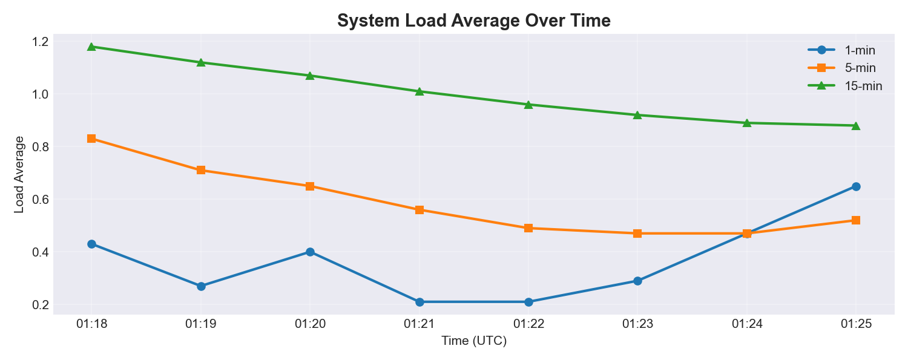
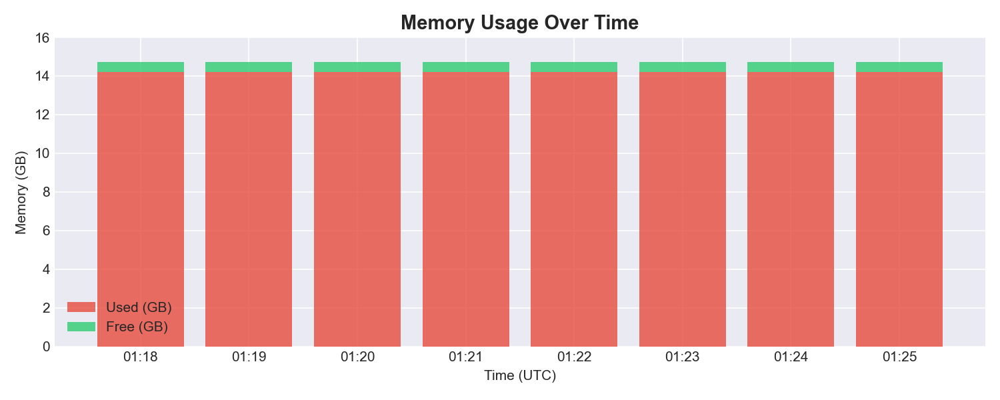
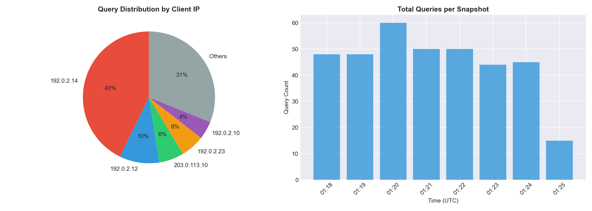
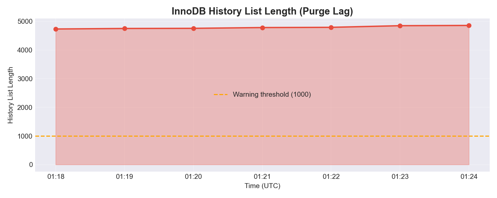
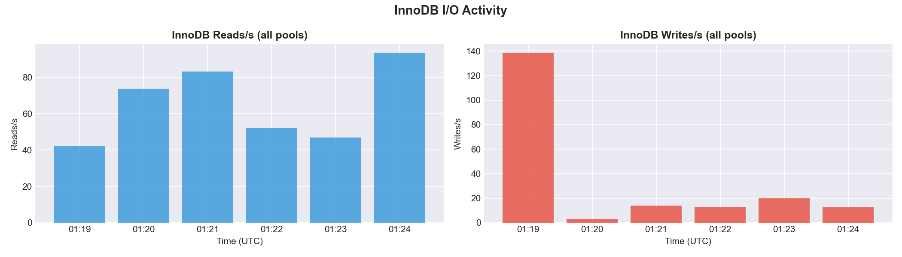
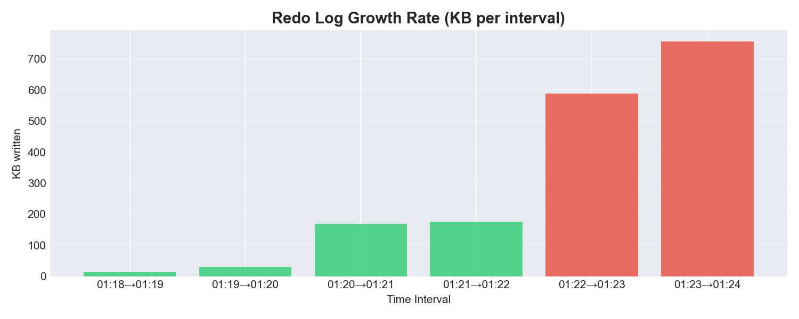
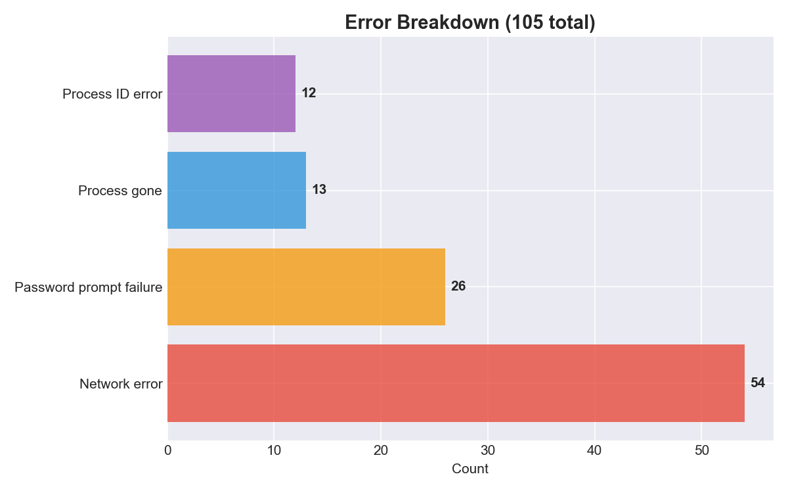

# MySQL DB-Master Log Analysis Report

**Host:** svc-db-node-001.internal.example-corp.com  
**Role:** db-master  
**Log Source:** /mnt/ops_logs/process_list.log  
**Period:** 2026-04-16 01:18 -- 01:25 UTC (8 snapshots, ~1 minute intervals)  
**Data:** 5,344 log lines parsed from sanitised CSV

---

## Summary

The database master server is exhibiting several concerning issues. InnoDB's purge thread is **stalled**, causing a continuously growing history list (4,735 to 4,859 in 7 minutes). The server is under **severe memory pressure** at 96.6% RAM utilization with only ~500 MB free. **Four separate mysqld processes** are competing for resources on a single host, and a **single client IP (192.0.2.14) generates 43% of all active queries**. An I/O write spike at 01:24 saw InnoDB writes surge 18x from baseline. Immediate action is needed on the purge stall and mysqld process consolidation.

---

## 1. System Resource Utilization

### 1.1 Load Average



| Time  | 1-min | 5-min | 15-min |
|-------|-------|-------|--------|
| 01:18 | 0.43  | 0.83  | 1.18   |
| 01:19 | 0.27  | 0.71  | 1.12   |
| 01:20 | 0.40  | 0.65  | 1.07   |
| 01:21 | 0.21  | 0.56  | 1.01   |
| 01:22 | 0.21  | 0.49  | 0.96   |
| 01:23 | 0.29  | 0.47  | 0.92   |
| 01:24 | 0.47  | 0.47  | 0.89   |
| 01:25 | 0.65  | 0.52  | 0.88   |

**Analysis:** The 15-min average is declining from a prior peak (1.18 to 0.88), indicating a recent period of higher load has passed. However, the 1-min average is rising again at 01:24--01:25 (0.47 to 0.65), signaling renewed workload from the I/O spike identified later in this report. For a 4-core server, all values are within acceptable range (below 4.0).

### 1.2 CPU Breakdown

| Metric       | Value |
|-------------|-------|
| User (%us)  | 18.5% |
| System (%sy)| 2.4%  |
| Idle (%id)  | 75.1% |
| IO Wait (%wa)| **3.8%** |
| SI + HI     | 0.2%  |

**Note:** CPU percentages are identical across all 8 snapshots. This is likely because the monitoring script uses `top -bn1` (single iteration batch mode), which reports cumulative averages since boot -- not real-time values. The actual instantaneous CPU utilization could differ significantly. This is a monitoring script issue that should be fixed by using `top -bn2` and discarding the first iteration.

**Finding:** 3.8% IO wait is elevated for a database server and indicates disk contention. During I/O bursts (like the write spike at 01:24), the actual IO wait is likely much higher.

### 1.3 Memory



| Time  | Total (GB) | Used (GB) | Free (GB) | Used % |
|-------|-----------|----------|----------|--------|
| 01:18 | 14.72     | 14.22    | 0.50     | 96.6%  |
| 01:19 | 14.72     | 14.20    | 0.52     | 96.5%  |
| 01:20 | 14.72     | 14.22    | 0.49     | 96.7%  |
| 01:21 | 14.72     | 14.22    | 0.50     | 96.6%  |
| 01:22 | 14.72     | 14.19    | 0.52     | 96.5%  |
| 01:23 | 14.72     | 14.20    | 0.52     | 96.5%  |
| 01:24 | 14.72     | 14.20    | 0.52     | 96.5%  |
| 01:25 | 14.72     | 14.20    | 0.52     | 96.5%  |

**Finding (CRITICAL):** Only ~500 MB of 14.7 GB is free (96.6% utilization). The server has virtually no memory headroom. Any additional memory demand -- a new connection burst, a large sort operation, or temp table creation -- could trigger swap thrashing, which would severely degrade database performance. Swap usage is currently low at ~97 MB / 8 GB.

---

## 2. MySQL Process Analysis

### 2.1 Multiple mysqld Instances

Four separate mysqld processes are running concurrently on this single host:

| PID     | CPU % | Started         | Cumulative CPU Time | Notes |
|---------|-------|-----------------|---------------------|-------|
| 4374    | 38%   | 2025 (111+ days)| 111d 00h+           | Primary master instance, long-running |
| 1744    | **59%** | Apr 05 (~11 days)| 6d 09h 57m        | **Highest CPU consumer** |
| 1775947 | 36%   | Apr 13 (~3 days)| 18h 10m             | Recent instance |
| 29467   | 13%   | Apr 15 (~1 day) | 3h 23m              | Newest, likely maintenance job |

**Finding (HIGH):** 4 mysqld processes on one server is abnormal. They consume a combined 146% CPU and each maintains its own buffer pool, fragmenting available cache memory. PID 1744 at 59% CPU is the highest consumer despite being the second-oldest -- its purpose should be investigated immediately.

**Possible causes:**
- Failed restart attempts that left orphan processes
- Co-located replicas on the master (bad practice)
- Test/maintenance instances that were never cleaned up

---

## 3. Queries Per Second (QPS) Analysis

### 3.1 QPS Distribution



**Total queries across all snapshots: 360**

| IP             | Total Queries | Share  | Queries/Snapshot | User Account |
|---------------|--------------|--------|-----------------|-------------|
| **192.0.2.14**| **154**      | **43%**| 22 (constant)   | beappro, app_user |
| 192.0.2.12    | 35           | 10%    | 0-11 (variable) | svc_user |
| 203.0.113.10  | 22           | 6%     | 6 -> 0 (declining) | dbuser |
| 192.0.2.23    | 21           | 6%     | 3 (constant)    | svc_user |
| 192.0.2.10    | 16           | 4%     | 2 (constant)    | app_user |
| Others (12 IPs)| 112         | 31%    | 1-3 each        | various |

### 3.2 QPS Over Time

| Time  | Total Queries | Notable Change |
|-------|--------------|----------------|
| 01:18 | 48           | Baseline |
| 01:19 | 48           | Stable |
| 01:20 | **60**       | **+25% spike** -- 192.0.2.12 jumped to 11 queries |
| 01:21 | 49           | Return to baseline |
| 01:22 | 50           | Stable |
| 01:23 | 42           | Slight dip |
| 01:24 | 43           | Stable |
| 01:25 | 15           | Partial snapshot (end of log window) |

**Finding (HIGH):** IP 192.0.2.14 generates exactly 22 queries in every single snapshot without variation. This rigid, unchanging pattern strongly suggests a **fixed-size connection pool of 22 connections**, each perpetually holding an active query. This is the primary QPS driver and likely represents either:
- A polling loop (e.g., `SELECT * FROM queue WHERE status='pending'` on a timer)
- An application that never releases connections back to the pool
- An N+1 query anti-pattern in application code

---

## 4. InnoDB Engine Health

### 4.1 Purge Status (CRITICAL)

| Time  | Trx Counter     | Purge At        | Gap      |
|-------|-----------------|-----------------|----------|
| 01:18 | 5,846,029,499   | 5,845,989,957   | 39,542   |
| 01:19 | 5,846,030,898   | 5,845,989,957   | 40,941   |
| 01:20 | 5,846,032,378   | 5,845,989,957   | 42,421   |
| 01:21 | 5,846,033,832   | 5,845,989,957   | 43,875   |
| 01:22 | 5,846,035,663   | 5,845,989,957   | 45,706   |
| 01:23 | 5,846,037,142   | 5,845,989,957   | 47,185   |
| 01:24 | 5,846,038,526   | 5,845,989,957   | 48,569   |

**Finding (CRITICAL):** The purge LSN is **stuck at 5,845,989,957** across all 7 snapshots. It has not advanced at all. Meanwhile, the transaction counter keeps incrementing at ~25 trx/sec, widening the gap from 39,542 to 48,569 unpurged transactions. This is almost certainly caused by a **long-running or abandoned transaction** that is preventing the purge thread from cleaning up old row versions.

### 4.2 History List Length



| Time  | History Length | Delta from previous |
|-------|--------------|---------------------|
| 01:18 | 4,735        | --                  |
| 01:19 | 4,753        | +18                 |
| 01:20 | 4,758        | +5                  |
| 01:21 | 4,785        | +27                 |
| 01:22 | 4,793        | +8                  |
| 01:23 | 4,850        | +57                 |
| 01:24 | 4,859        | +9                  |

**Finding (CRITICAL):** The history list is growing monotonically, from 4,735 to 4,859 (+124 in 7 minutes). A healthy value is below 1,000. At ~18/minute growth rate, this will continue to worsen, causing:
- Increased undo tablespace disk usage
- Slower read queries (longer MVCC version chains to traverse)
- Buffer pool pollution (undo pages displacing data pages)

### 4.3 Transaction Rate

| Interval      | Trx Delta | Duration | TPS   |
|--------------|-----------|----------|-------|
| 01:18 -> 01:19 | 1,399   | ~58s     | 24.1  |
| 01:19 -> 01:20 | 1,480   | ~61s     | 24.3  |
| 01:20 -> 01:21 | 1,454   | ~60s     | 24.2  |
| 01:21 -> 01:22 | 1,831   | ~61s     | **30.0** |
| 01:22 -> 01:23 | 1,479   | ~58s     | 25.5  |
| 01:23 -> 01:24 | 1,384   | ~60s     | 23.1  |

**Average: ~25 transactions/sec.** The spike to 30 TPS in the 01:21--01:22 window is a 24% increase from average but not alarming on its own.

### 4.4 I/O Activity



| Time  | Total Reads/s | Total Writes/s | Queries Inside InnoDB |
|-------|--------------|---------------|----------------------|
| 01:18 | 42.2         | **138.9**     | 0                    |
| 01:19 | 73.8         | 3.0           | 0                    |
| 01:20 | 83.3         | 14.0          | 1                    |
| 01:21 | 52.0         | 12.8          | 0                    |
| 01:22 | 46.8         | 19.8          | 2                    |
| 01:23 | 93.7         | 12.6          | 0                    |
| 01:24 | **254.9**    | **236.4**     | 1                    |

**Finding (HIGH):** Two significant I/O spikes are visible:
1. **01:18** -- Writes at 138.9/s (likely tail end of a prior batch operation)
2. **01:24** -- Both reads (255/s) and writes (236/s) surged dramatically, an **18x increase** in writes from the 01:23 baseline. This correlates with the redo log acceleration below.

### 4.5 Redo Log Growth



| Interval        | LSN Delta (bytes) | Rate (KB/min) | Multiplier vs baseline |
|----------------|-------------------|---------------|----------------------|
| 01:18 -> 01:19 | 14,412            | 14.1          | 1x (baseline)        |
| 01:19 -> 01:20 | 30,687            | 30.0          | 2x                   |
| 01:20 -> 01:21 | 173,373           | 169.3         | 12x                  |
| 01:21 -> 01:22 | 179,340           | 175.1         | 12x                  |
| 01:22 -> 01:23 | 602,632           | 588.5         | **42x**              |
| 01:23 -> 01:24 | 773,902           | 755.8         | **54x**              |

**Finding (HIGH):** Redo log write rate accelerated 54x from baseline. This confirms a large volume of data modifications occurring in the 01:22--01:24 window, likely a batch job, ETL process, or bulk data operation. If the redo log files fill up before InnoDB can flush dirty pages, MySQL will stall all writes until flushing catches up.

### 4.6 Buffer Pool Hit Rate

| Pool   | 01:18 | 01:19   | 01:20 | 01:21 | 01:22 | 01:23 | 01:24 |
|--------|-------|---------|-------|-------|-------|-------|-------|
| Pool 0 | 998   | 996     | 999   | 997   | 999   | 998   | 997   |
| Pool 1 | 997   | **993** | 999   | 996   | 999   | 997   | 998   |
| Pool 2 | 998   | 995     | 999   | 997   | 998   | 998   | 997   |
| Pool 3 | 997   | **994** | 999   | 998   | 999   | 998   | 997   |
| Pool 4 | 999   | 997     | 999   | 998   | 999   | 998   | 998   |

*Values are per 1,000 page accesses.*

**Finding (MEDIUM):** Pool 1 and Pool 3 dipped to 993 and 994/1000 at 01:19, meaning 0.6--0.7% of page requests went to disk. While still above 99%, for a high-throughput OLTP database, this suggests the buffer pool is undersized for the working set. The issue is amplified by having 4 mysqld instances each with their own buffer pool.

---

## 5. Errors and Monitoring Issues



**Total errors: 105 across 7 minutes**

| Error Type                | Count | Affected Hosts | Frequency |
|--------------------------|-------|----------------|-----------|
| Network error (trace skip)| 54   | 198.51.100.14, .16, .10 | Every snapshot |
| Password prompt failure   | 26   | 192.0.2.12, 192.0.2.10 | Every snapshot |
| Process no longer exists  | 13   | 192.0.2.24             | Intermittent |
| Process ID syntax error   | 12   | Various                | Intermittent |

**Finding (MEDIUM):** These are **monitoring script failures**, not MySQL errors. The monitoring tool consistently fails to trace connections to multiple hosts due to missing SSH keys (password prompts) and network connectivity issues. These failures recur in every single snapshot, indicating a systemic configuration problem -- not a transient issue. The noise from 105 errors in 7 minutes makes it harder to spot real problems.

---

## 6. Summary of Findings and Recommendations

| # | Issue | Severity | Root Cause | Recommended Action |
|---|-------|----------|------------|-------------------|
| 1 | InnoDB purge stalled | **Critical** | Long-running/abandoned transaction blocking purge at trx 5,845,989,957 | Find oldest open transaction (`SELECT * FROM information_schema.INNODB_TRX ORDER BY trx_started LIMIT 1`), kill if idle, increase `innodb_purge_threads` |
| 2 | Memory at 96.6% | **Critical** | 4 mysqld instances + buffer pools consuming nearly all 14.7 GB | Consolidate to 1 mysqld instance, right-size `innodb_buffer_pool_size` to ~10-11 GB, consider adding RAM |
| 3 | 4 mysqld processes | **High** | Orphaned processes from failed restarts or co-located instances | Identify purpose of each PID, shut down unnecessary ones, ensure clean startup/shutdown scripts |
| 4 | 192.0.2.14 dominates QPS (43%) | **High** | Fixed 22-connection pool with persistent active queries, likely polling loop | Profile queries with slow query log, check for polling patterns, optimize application connection management |
| 5 | I/O write spike at 01:24 (18x) | **High** | Batch job / ETL / bulk operation | Identify the scheduled job, consider off-peak scheduling, monitor `innodb_log_waits` |
| 6 | Monitoring script errors (105) | **Medium** | SSH auth failures and network issues in trace script | Fix SSH keys for 192.0.2.12 and .10, verify network to 198.51.100.x hosts |
| 7 | Buffer pool hit rate dips | **Medium** | Buffer pool undersized for working set, fragmented across 4 instances | Consolidate mysqld instances, allocate freed memory to buffer pool |
| 8 | 3.8% IO wait | **Medium** | Disk throughput limitations, amplified by write bursts | Evaluate SSD/NVMe storage, separate redo logs from data files, tune `innodb_io_capacity` |

---

## Appendix: How to Reproduce This Analysis

```bash
# Install dependencies
pip install -r requirements.txt

# Run the analysis script
python analyze_logs.py

# Output:
#   - Console summary with flagged issues
#   - report_figures/ directory with 7 PNG charts
```

The analysis script (`analyze_logs.py`) parses the CSV log file using regex pattern matching to extract metrics from each 1-minute snapshot, then generates matplotlib charts and a text summary.

---

*Report generated from Logs-sanitised-2026-04-17_For Assesment.csv*
